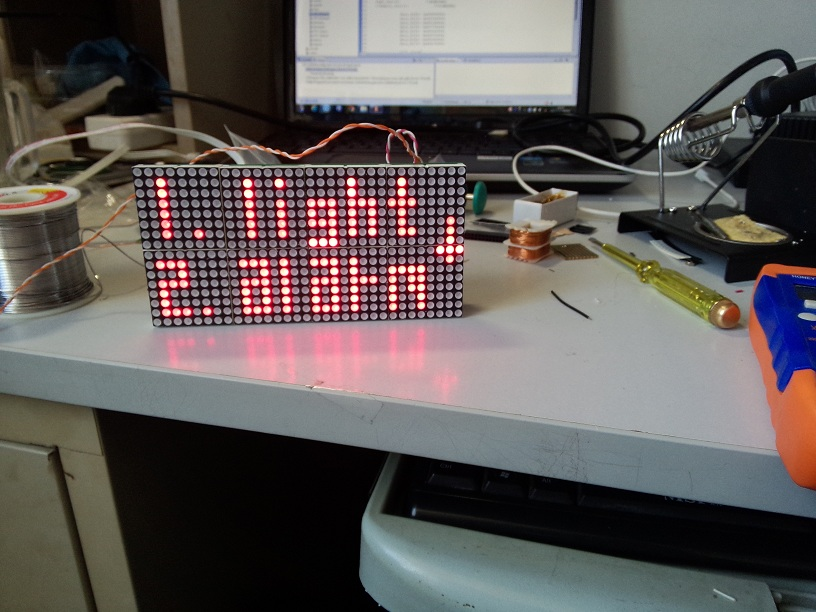

# LCD_screen_clock
an multi-function clock using LCD screen

---

基于STM32主控芯片，采用16*64位LCD点阵屏，完成一个多功能的电子 时钟，具有以下特点：  

1. 时间日期任意切换和显示  
2. 定时音乐闹钟，带贪睡功能  
3. 环境温度检测  
4. 红外遥控与按键控制兼容  
5. 自动校准

将逐步支持：    

1. 网络自动获取和对时  
2. 语音播报  
3. 天气获取

---
开发环境：兼容coocox IDE或uVersion MDK  
调用外部库：STM32官方固件库  
代码目录：  
cmsis/    内核启动文件  
cmsis_boot/ STM32基础库文件  
include/    头文件  
src/    源文件    
stm_lib/    STM32固件库

---

效果图  

